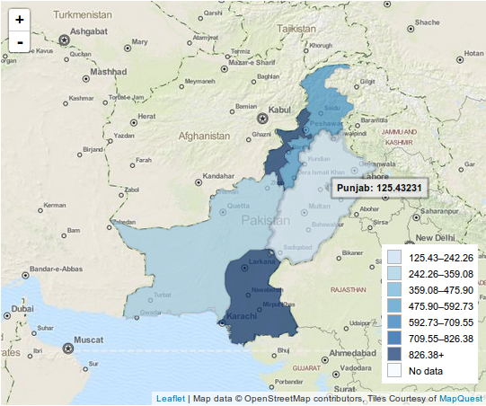
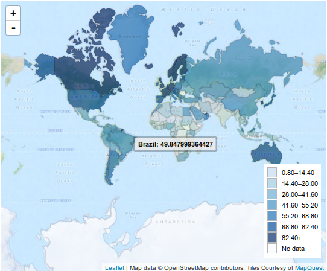

ckanext-choroplethmap
=====================



This extension adds choropleth maps to CKAN, using the new Resource View being
developed in https://github.com/ckan/ckan/tree/1251-resource-view.

It uses [LeafletJS](http://leafletjs.com), which is compatible with all major
browsers (including IE7+).

Installation
------------

To use it, simply clone this repository and run ```python setup.py install```.
Then add ```choroplethmap``` to the list in ```ckan.plugins``` in your CKAN
config file.

Restart your webserver. You should see the new "Choropleth Map" chart type as
an option in the view type's list on any resource that's in the DataStore.

Usage
-----

### Pre-requisites

To start creating choropleth maps, you need two things: the data you want to
plot, and a GeoJSON defining the geographical regions you'd like to plot it.
The data itself needs to be in a resource inside the DataStore, and the map
needs to be in the same domain as CKAN itself (to avoid [same-origin
policy](http://en.wikipedia.org/wiki/Same-origin_policy) issues). The easiest
way to do so is to upload the GeoJSON as another resource.

Each GeoJSON feature needs a property related to a column in the data. It can
be an id, name, or anythings that uniquely identifies that feature, so we know
where to plot the data.

### Example

We'll create a map to try to understand the internet usage across the world. To
do so, we need a worldmap in GeoJSON and the internet usage data.

A good source of GeoJSON files is the [Natural Earth
Data](http://naturalearthdata.com/) website. We'll be using their [world map at
1:110 million
scale](https://github.com/nvkelso/natural-earth-vector/blob/master/geojson/ne_110m_admin_0_countries.geojson).

The data comes from the [World Bank's Data
Bank](http://databank.worldbank.org/data/home.aspx). There we select the
indicator we're interested in (Internet usage per 100 people), build a report
for all countries, and download the data as CSV. It looks like this:

| Country Name   | Country Code | Indicator Name                  | Indicator Code | 2012             |
| -------------- | ------------ | ------------------------------- | -------------- | ---------------- |
| Afghanistan    | AFG          | Internet users (per 100 people) | IT.NET.USER.P2 | 5.45454545454545 |
| Albania        | ALB          | Internet users (per 100 people) | IT.NET.USER.P2 | 54.6559590399494 |
| Algeria        | DZA          | Internet users (per 100 people) | IT.NET.USER.P2 | 15.2280267564417 |
| American Samoa | ASM          | Internet users (per 100 people) | IT.NET.USER.P2 |                  |
| Andorra        | ADO          | Internet users (per 100 people) | IT.NET.USER.P2 | 86.4344246167258 |
| ...            | ...          | ...                             | ...            | ...              |

To identify each country, we have its name and code. We need to have either
attribute in the GeoJSON feature's properties. Opening that file, we see:

```javascript
{
  "features": [
    {
      "geometry": {
        "coordinates": [
          // ...
        ],
        "type": "Polygon"
      },
      "properties": {
        "name": "Afghanistan",
        "region_un": "Asia",
        "region_wb": "South Asia",
        "wb_a3": "AFG",
        // ...
      },
      "type": "Feature"
    },
    // ...
  ]
}
```

We can map either ```Country Name``` with ```name```, or ```Country Code```
with ```wb_a3```. Let's use the country code.

In your CKAN instance, create a new dataset (i.e. "World Bank's Indicators"),
and upload two resources: the GeoJSON and the data file.

Go to the data file's manage resource page and create a new ```Choropleth
Map``` view. You'll see a form with a few fields. Use "Internet usage across
the globe" as a title, leave the description empty (if you want). Then, we need
to add the GeoJSON. We need two things: its URL and the key field. To get the
URL, go to its resource page (that you just created), copy the download
link (it should look like
```http://demo.ckan.org/dataset/f07ffd99-739b-465f-93e9-bfx2576b1b5d/resource/e24c50f4-48e7-4bc4-9e12-54f3141bcf5b/download/countries.geojson```),
and paste in that field.

The ```GeoJSON Key Field``` should be ```wb_a3```, as we found out before.
We'll link that field to the ```Country Code``` column in our data, so set it
in the ```Key``` field.

Now, we just need to select what value we want to plot (in our case,
the ```2012``` column), and what label to use (```Country Name```). You can
leave the remaining fields blank. In the end, we'll have:

| GeoJSON URL |
http://demo.ckan.org/dataset/f07ffd99-739b-465f-93e9-bfx2576b1b5d/resource/e24c50f4-48e7-4bc4-9e12-54f3141bcf5b/download/countries.geojson
|
| GeoJSON Key Field | wb_a3 |
| Key | Country Code |
| Value | 2012 |
| Label | Country Name |
| Redirect to URL | |
| Fields | |

Click on ```Preview``` and you should see a map like:



Congratulations! You've just created your first choropleth map.

License
-------

Copyright (C) 2014 Open Knowledge Foundation

This program is free software: you can redistribute it and/or modify
it under the terms of the GNU Affero General Public License as published
by the Free Software Foundation, either version 3 of the License, or
(at your option) any later version.

This program is distributed in the hope that it will be useful,
but WITHOUT ANY WARRANTY; without even the implied warranty of
MERCHANTABILITY or FITNESS FOR A PARTICULAR PURPOSE.  See the
GNU Affero General Public License for more details.

You should have received a copy of the GNU Affero General Public License
along with this program.  If not, see <http://www.gnu.org/licenses/>.
